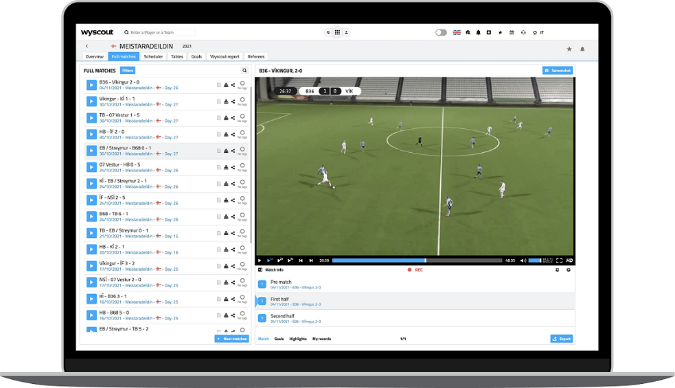

# wyscout-scraper

> python scraper using `selenium` for [wyscout](https://www.hudl.com/products/wyscout)

### The world’s biggest library of football video and data.

Excel input and output:

```yaml
input.xlsx
session.xlsx
```



&copy; 2024 @codeguru827

All rights reserved.
